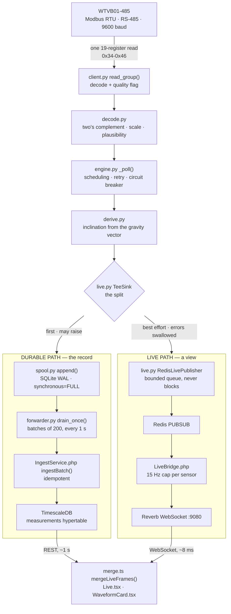

# QuakeVault Industrial

**Structural vibration monitoring appliance.** WTVB01-485 over Modbus RTU /
RS-485, on a dedicated Ubuntu host.

This is structural monitoring, not machine condition monitoring. The governing
standards are DIN 4150-3 and BS 7385-2, which grade *peak particle velocity* by
structure type and frequency — a different question, and different arithmetic,
from asking whether a motor is healthy.

The principle behind every decision here is one sentence:

> **Refusing to answer is better than answering with a plausible number that is
> wrong.** On a monitoring appliance, a wrong number is more dangerous than no
> number.

---

## Contents

1. [What it does](#1-what-it-does)
2. [Data flow](#2-data-flow)
3. [The two-path architecture](#3-the-two-path-architecture)
4. [Modbus and RS-485](#4-modbus-and-rs-485)
5. [Failure behaviour](#5-failure-behaviour)
6. [Measured performance](#6-measured-performance)
7. [What this appliance refuses to do](#7-what-this-appliance-refuses-to-do)
8. [Known limitations](#8-known-limitations)
9. [Quick start](#9-quick-start)
10. [Repository layout](#10-repository-layout)
11. [Documentation index](#11-documentation-index)
12. [Project status](#12-project-status)

---

## 1. What it does

Reads a WTVB01-485 vibration sensor over RS-485, decodes its registers into
engineering units, stores every reading durably, evaluates structural vibration
thresholds, and presents it on a live dashboard — with a wall-display mode for a
control room.

**Stack**

| Layer | Technology |
|---|---|
| Acquisition | Python 3.12, pymodbus, systemd (never containerised) |
| Store-and-forward | SQLite WAL spool → HTTP → Laravel |
| Backend | Laravel 13 / PHP 8.4, Sanctum token abilities |
| Database | TimescaleDB (PostgreSQL 18) hypertable |
| Live feed | Redis pub/sub → Laravel Reverb → WebSocket |
| Frontend | React 19, TypeScript 6, Vite 8, Tailwind 4, ECharts 6 |
| Integration | MQTT (Mosquitto), one-way |

**Adding a sensor means writing a profile, never changing the engine.** Register
maps, scale factors, data types and plausibility ranges all live in
`profiles/*.yaml`.

---

## 2. Data flow



### Stage by stage

| Stage | File · function | Responsibility |
|---|---|---|
| Bus read | `client.py:95` `read_group()` | One 19-register transaction covering 16 channels |
| Decode | `decode.py:38` `decode_raw()` | Two's complement, word order, int16/uint16 |
| Scale | `decode.py:76` `apply_scaling()` | `raw × scale + offset`, factors from YAML |
| Plausibility | `decode.py:108` `plausible()` | Out of declared range → `implausible` |
| Schedule | `engine.py:285` `_poll()` | Retry, circuit breaker, sequence, `run_id` |
| Derive | `derive.py` `derive_for_group()` | Roll, pitch, tilt from gravity |
| **Split** | `live.py:143` `TeeSink.__call__()` | **Durable first and may fail; live second and cannot** |
| Spool | `spool.py:120` `append()` | WAL, SHA-256, idempotency key |
| Forward | `forwarder.py:190` `drain_once()` | Batch, exponential backoff |
| Ingest | `IngestService.php:41` | Idempotent insert |
| Merge | `lib/merge.ts` `mergeLiveFrames()` | Live frames only after the newest stored point |

---

## 3. The two-path architecture

**Durability and low latency are in tension.** The durable path — spool, forward
in order, insert, poll — costs about a second. That second buys "nothing is lost
when the database or network are down", which is the right trade for a *record*
and the wrong one for somebody standing at a wall display tapping a structure.

The tempting fix was to make the durable path faster. That is the wrong answer:
every second shaved off it trades away delivery guarantee. So there are two
paths, not a compromise.

| | Durable | Live |
|---|---|---|
| Role | System of record | A view |
| Guarantee | Nothing is lost | May drop frames freely |
| Latency | ~1 s | **p50 8 ms** |
| On failure | Data waits in the spool | Dashboard falls back to polling |

### What protects the record from the dashboard

```python
class TeeSink:
    def __call__(self, measurement: Measurement) -> None:
        self.durable(measurement)          # first, and allowed to raise
        for sink in self.best_effort:
            try:
                sink(measurement)
            except Exception as exc:
                log.debug("best-effort sink failed: %s", exc)   # swallowed
```

Three layers:

1. **Order.** The durable sink runs first. Any live failure happens after the
   reading is already stored.
2. **Isolation.** Live-sink exceptions are swallowed and never propagate.
3. **Non-blocking.** Publishing runs on a background thread with a bounded queue
   of 500. When full it drops the *newest* frame and counts it — it never blocks
   the poll loop, which is the one thing in this service that must not be
   delayed.

**Verified:** Redis stopped for 20 s — acquisition unaffected, 7,264 readings
recorded during the outage.

**The inverse also holds.** `LiveMeasurement` deliberately carries no alarm or
threshold state. The live channel drops frames by design, so nothing on it should
be actionable. A test enforces this.

### When the durable path fails

The spool absorbs it. **Verified:** TimescaleDB stopped for 30 s — backlog grew
11 → 331, drained on recovery, **14,684 rows recovered, none lost.** Capacity is
500,000 envelopes, measured at **10.1 hours** of outage coverage.

---

## 4. Modbus and RS-485

### One transaction, not three

Modbus RTU overhead is per *transaction*, not per register. At 9600 baud:

| Read size | Transaction | Per register |
|---|---|---|
| 3 registers | 36.1 ms | **12.0 ms** |
| 19 registers | 69.4 ms | **3.7 ms** |

Acceleration (`0x34-0x36`), velocity (`0x3A-0x3C`) and the temperature /
displacement / frequency block (`0x40-0x46`) are read as **one 19-register
transaction**.

**Result:** every channel moved from 8/4/4 Hz to **~9.4 Hz**, while bus
utilisation *fell* from 0.669 to **0.649**.

**And it removed an artefact.** Three transactions carried three timestamps, so
acceleration and velocity of the same instant were recorded milliseconds apart —
drawing a skew between cards that was not in the structure. One read, one
timestamp.

### Poll rates are modelled, then measured

`throughput.py` computes from first principles — frame bytes, 3.5-character
interframe idle, device turnaround, USB-bridge latency by chip (`ch340: 4.0 ms`,
`ftdi: 1.5`, `cp210x: 2.0`) — then reserves 20% margin and 5% for retries. The
model is checked against `quakevault_bus_utilisation_ratio` in production.

### Bus serialisation

RS-485 is half-duplex; two overlapping transactions corrupt each other. The
guarantee is structural rather than a lock:

```python
# One thread per bus. No two transactions on this port can ever overlap.
self._executor = ThreadPoolExecutor(max_workers=1, ...)
```

Scheduling is earliest-deadline-first, so a fast group cannot starve a slow one.

### Where units are converted

**Scale factors live in the profile, not in code:**

```yaml
- {key: accel_x,        unit: g,    address: 0x34, scale: 0.00048828125, minimum: -16, maximum: 16}
- {key: vib_velocity_x, unit: mm/s, address: 0x3A, data_type: uint16, scale: 0.01, minimum: 0, maximum: 655.35}
- {key: temperature,    unit: degC, address: 0x40, scale: 0.01, minimum: -40, maximum: 125}
```

**Two's complement lives in `decode.py`:**

```python
if data_type == "int16":
    return words[0] - 0x10000 if words[0] & 0x8000 else words[0]
```

### The decode fault worth knowing about

Velocity and displacement were decoded as *signed* until a hard shake exposed
them. Two adjacent samples of a smoothly rising magnitude:

```
raw 31932  →  +319.32 mm/s
raw 33530  →  −320.06 mm/s
```

A 640 mm/s reversal between consecutive readings is not physics. They are
**unsigned magnitudes**; above 32767 counts a signed read inverts them.

585 bench samples never caught it, because a stationary sensor never approaches
the boundary. **The decode was correct everywhere it was tested and wrong exactly
in the regime the instrument exists to measure.** The lesson is that a static
bench cannot verify a register's *type*.

143 historical rows were recomputed from the raw register words stored beside
every reading — which is why they are stored.

---

## 5. Failure behaviour

| Condition | Response | Code |
|---|---|---|
| No response / cable pulled | Retry, then circuit breaker opens after 3 failures, 5 s cooldown, HALF_OPEN probe. Values `None`, quality `bad`. **Service does not exit.** | `client.py:120`, `engine.py:135` |
| Value outside declared range | Recorded and flagged `implausible`. Spectrum endpoint reads only `good` | `client.py:150` |
| CRC corruption | `quality=bad`, all values `None`. **Nothing is decoded from noise** | `client.py:120` |
| WebSocket drops | Chart falls back to 1 s REST polling, badge changes to `polling`, buffered frames cleared | `lib/live.ts:53` |
| Database down | Spool absorbs, drains on recovery | `spool.py`, `forwarder.py` |
| Power loss mid-write | WAL + `synchronous=FULL`. Verified: `integrity_check ok`, 500,000 rows intact after `SIGKILL` | `spool.py` |

**A missing reading is never filled with 0 or the previous value.** Plotted as
zero it would look like a still structure rather than absent data.

---

## 6. Measured performance

All figures read from the running system, not estimated.

| Metric | Value |
|---|---|
| Live path latency | **p50 8 ms**, p95 12 ms, max 22 ms |
| Durable path latency | ~1 s |
| Poll rate (motion group) | **9.37 Hz** measured, 10 Hz configured |
| Bus utilisation | **0.649** |
| Throughput | ~11,700 rows / 60 s |
| Spool outage coverage | **10.1 hours** (500,000 envelopes) |
| Storage growth | ~4.4 GB/day uncompressed, compressed after 2 days |
| Defensible spectral band | 3.205 Hz (0.4 × fs) |

**Fault injection:** 14 of 20 cases pass, 1 partial, 4 need hardware not on the
bench. See `docs/acceptance-results.md`.

**Tests:** 33 frontend · 185 backend · 282 acquisition and acceptance.

---

## 7. What this appliance refuses to do

These are features, and the reasoning matters more than the behaviour.

**It refuses to draw an indefensible spectrum.** Polled Modbus is not uniformly
sampled, so it uses a Lomb-Scargle periodogram rather than an FFT, and advertises
only 0.4 × fs rather than Nyquist's fs/2. Beyond that it returns an explanation
instead of a chart.

**It refuses to report a transient as a spectrum.** A three-second tap inside a
fifteen-minute window is not stationary, and a periodogram will confidently
return a peak that describes the *window length*. Energy concentration is
measured; above 50% in one tenth of the window, no component is reported.

**It refuses to call drift a finding.** The linear trend is removed and the
bottom three bins are plotted but never reportable — slow drift is not vibration.

**It refuses to notify on unconfirmed thresholds.** DIN 4150-3 and BS 7385-2 are
copyrighted and unavailable, so the tables are marked `candidate`. Alarms from
them are `provisional`: displayed, never notifying, until a named person confirms
them against the published document.

**It refuses to start on an unverified register map.** A profile that is not
`verified` cannot reach production by accident.

**It refuses to fit a calibration from bad data.** A capture is rejected if the
sensor was moving; a solve is rejected below 0.8 axis coverage. Six captures all
taken flat would produce confident numbers constraining one axis — worse than no
calibration, because it looks like one.

---

## 8. Known limitations

Full detail in `docs/known-limitations.md`. The ones that change how you read the
dashboard:

**Acceleration registers are not a waveform.** `0x34-0x36` is heavily filtered
inside the device. Measured: 390 reads at 32.5 Hz produced *zero* value changes,
and during real taps the acceleration span was 0.0000 g. **Use the Acceleration
amplitude card** (`0x37-0x39`) for vibration. Raising the baud rate does not help
— the limit is the device.

**Tilt lags by about nine seconds.** Measured across four movements: 9.0 s
settling, 4.33° drift after the sensor physically stopped. It is the device's
filter, not the pipeline (25 ms end to end), and cannot be corrected in software
— inverting an unspecified filter would be guesswork presented as a reading.

**The displacement range mode is invisible over Modbus.** Two settings differ by
100×, and no register reports which is active. Detected by physics instead:
`v = 2πfA`, with frequency reported independently. Run
`php artisan measurements:check-units` after any sensor reconfiguration.

**Accelerometer axes disagree by ~3%.** Gravity reads 0.9898 g on X and 0.9625 g
on Z. Per-axis MEMS gain error, worth up to ~2° of inclination error.
Six-position calibration is implemented but not yet applied.

**Condition indicators are unverified in the large-amplitude regime.** The 36
indicators are decoded as signed; some must be (skewness), others cannot be
(RMS). They sit near zero on a bench and carry the same latent risk that velocity
did.

---

## 9. Quick start

```bash
docker compose up -d
sudo ./deploy/install-acquisition.sh
```

```bash
sudo -u quakevault-acq /var/www/quakevault-industrial/.venv/bin/qv-acq \
    --check --config /etc/quakevault/acquisition.yaml
```

```bash
systemctl is-active quakevault-acq quakevault-forwarder quakevault-reverb quakevault-live-bridge
```

**Inspect registers** (the serial port is exclusive — stop acquisition first):

```bash
sudo systemctl stop quakevault-acq
sudo -u quakevault-acq /var/www/quakevault-industrial/.venv/bin/qv-probe --start 0x34 --count 20 --watch
sudo systemctl start quakevault-acq
```

**Verify units after any sensor reconfiguration:**

```bash
cd backend && php artisan measurements:check-units
```

**Backup, with the restore verified:**

```bash
./acceptance/backup-restore.sh
```

**Upgrade, with automatic rollback:**

```bash
./deploy/upgrade.sh <git-ref>
./deploy/upgrade.sh --rollback
```

Acquisition keeps running throughout — verified at 23,056 readings recorded
across a real upgrade.

---

## 10. Repository layout

```
acquisition/          Python service (systemd, never containerised)
  src/qv_acq/
    client.py         Modbus reader — the protocol boundary
    decode.py         Registers to engineering units
    engine.py         Scheduling, retry, circuit breaking
    derive.py         Inclination from the gravity vector
    live.py           TeeSink and the Redis publisher
    spool.py          SQLite WAL store-and-forward
    forwarder.py      Batch delivery with backoff
    throughput.py     Bus capacity model and spectral gate
    probe.py          qv-probe — register inspection
    calibration.py    Six-position accelerometer fit
    simulator/        Modbus RTU simulator with fault injection

backend/              Laravel 13
  app/Services/       Ingest, alarms, notifications, spectrum, reports, MQTT
  app/Support/        Roles, StructuralVibration tables

frontend/             React 19 + Vite 8
  src/lib/            api, live, merge, staleness
  src/pages/          Live, Signal, Alarms, Overview, Kiosk

profiles/             Sensor register maps (YAML)
deploy/               systemd units, udev rules, installer, upgrade
acceptance/           Fault injection, soak, backup/restore
docs/                 See below
```

---

## 11. Documentation index

| Document | For |
|---|---|
| `docs/operator-manual.md` | Watching the dashboard. No terminal required |
| `docs/administrator-manual.md` | Install, configure, upgrade, back up |
| `docs/troubleshooting.md` | Symptom-first, from faults that actually occurred |
| `docs/api.md` | All 15 endpoints, abilities, payloads |
| `docs/mqtt-topics.md` | Topics, QoS, retention, ACL |
| `docs/testing.md` | Four test suites and what each covers |
| `docs/decision-log.md` | ADR-001 … ADR-025 — every decision and its cost |
| `docs/known-limitations.md` | What this cannot do, with measurements |
| `docs/acceptance-results.md` | The 20-case fault matrix |
| `docs/register-maps.md` | Register verification method and `qv-probe` |
| `docs/handover-zh.md` | Technical handover (Traditional Chinese) |

---

## 12. Project status

**Working and verified**

Acquisition, store-and-forward, ingestion, alarms, notifications, reports, MQTT,
live dashboard, signal analysis, kiosk mode, fault injection, backup and restore,
upgrade and rollback.

**Requires hardware not on the bench**

Fault matrix cases 2–5: an HWT901B-485, and a second working WTVB01-485 (the
spare is faulty — its Y and Z velocity and displacement registers return exactly
zero while the same axes report 108 and 126 Hz, which is self-contradictory).

**Requires a decision or an action**

- Six-position accelerometer calibration (implemented, not applied)
- DIN 4150-3 / BS 7385-2 to confirm the threshold tables — until then no
  structural alarm can notify anyone
- Deployment details: which standard, structure class, and whether the sensor is
  on the foundation or an upper floor. These change the limits several-fold

**Not covered by tests**

The Signal page, routing, the login flow, and anything visual are hand-verified
only.
