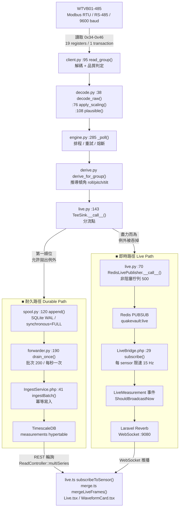

# QuakeVault Industrial — 技術導覽與交接報告

WTVB01-485 結構振動監測系統
版本：profile 1.1.0 · 文件日期 2026-08-03

---

## 1. 資料流與關鍵檔案

### 1.1 全景圖



### 1.2 逐段說明（含檔案路徑與行號）

| # | 階段 | 檔案 · 函式 | 做了什麼 |
|---|---|---|---|
| 1 | 匯流排讀取 | `acquisition/src/qv_acq/client.py:95` `read_group()` | 一次讀 19 個 register（0x34–0x46），涵蓋加速度、加速度振幅、速度、位移、頻率、溫度 |
| 2 | 解碼 | `decode.py:38` `decode_raw()` | 二補數處理、word order、int16/uint16 判定 |
| 3 | 換算 | `decode.py:76` `apply_scaling()` | `raw × scale + offset`，scale 來自 profile YAML 而非程式碼 |
| 4 | 合理性檢查 | `decode.py:108` `plausible()` | 超出宣告範圍即標記 `implausible` |
| 5 | 排程與容錯 | `engine.py:285` `_poll()` | 重試、熔斷、序號、run_id |
| 6 | 推導 | `derive.py` `derive_for_group()` | 由重力向量推導 roll / pitch / tilt（本機無角度暫存器） |
| 7 | **分流** | `live.py:143` `TeeSink.__call__()` | **耐久路徑先執行且允許失敗；即時路徑後執行且例外被吞掉** |
| 8a | 落地 | `spool.py:120` `append()` | SQLite WAL + `synchronous=FULL`，SHA-256 校驗、冪等鍵 |
| 8b | 推播 | `live.py:70` `__call__()` | 丟進大小 500 的佇列，滿了就丟棄最新的，**絕不阻塞** |
| 9a | 轉送 | `forwarder.py:190` `drain_once()` | 每秒一批 200 筆，失敗指數退避 |
| 9b | 中繼 | `LiveBridge.php:29` | 訂閱 Redis，每 sensor/group 限速 15 Hz |
| 10a | 入庫 | `IngestService.php:41` `ingestBatch()` | 冪等（`appliance:run_id:sensor:group:sequence`） |
| 10b | 廣播 | `LiveMeasurement` → Reverb | `ShouldBroadcastNow`，頻道 `sensor.{id}` |
| 11 | 前端合併 | `frontend/src/lib/merge.ts` `mergeLiveFrames()` | **即時幀只能接在最新的已存點之後** |
| 12 | 呈現 | `pages/Live.tsx` · `components/WaveformCard.tsx` | ECharts，`animation: false` |

### 1.3 實測數字（目前運行中）

| 指標 | 數值 |
|---|---|
| 匯流排使用率 | **0.6487** |
| motion 群組實測輪詢率 | **9.37 Hz**（設定 10 Hz） |
| 寫入量 | **11,678 筆 / 60 秒** |
| 即時路徑延遲 | **p50 8 ms、p95 12 ms**（走 systemd 為 p50 25 ms） |
| 耐久路徑延遲 | 約 1 秒 |

---

## 2. 硬體與通訊細節

### 2.1 最關鍵的優化：合併交易（ADR-023）

**問題**：Modbus RTU 的開銷是「每筆交易」而非「每個 register」。在 9600 baud 下：

```
request  = addr(1) + func(1) + start(2) + count(2) + crc(2)      = 8 bytes
response = addr(1) + func(1) + bytecount(1) + 2N data + crc(2)   = 5 + 2N bytes
再加上：3.5 字元閒置時間 ×2 + 裝置 turnaround + USB 橋接延遲
```

| 讀取大小 | 交易時間 | 每 register 成本 |
|---|---|---|
| 3 registers | 36.1 ms | **12.0 ms** |
| 19 registers | 69.4 ms | **3.7 ms** |

**做法**：把加速度（0x34–0x36）、速度（0x3A–0x3C）、溫度/位移/頻率（0x40–0x46）合併成單一 19-register 交易。

**結果**：所有通道從 8/4/4 Hz 提升到 **~9.4 Hz**，而匯流排使用率**反而從 0.669 降到 0.649**。

**額外收穫（比速度更重要）**：三次交易帶三個時間戳，同一瞬間的加速度與速度會被記錄成相差數毫秒 —— 圖表上看起來像卡片之間有時間差，但結構上並不存在。合併後一次讀取、一個時間戳。

> 模型程式碼：`acquisition/src/qv_acq/throughput.py`（`transaction_ms()`、`estimate()`）
> USB 橋接延遲按晶片分別計價：`ch340: 4.0 ms`、`ftdi: 1.5 ms`、`cp210x: 2.0 ms`

### 2.2 Polling rate 怎麼算出來的

不是猜的。`throughput.py` 從第一原理建模，再用實測校正：

1. 由 baud、register 數計算單筆交易時間
2. 乘上輪詢頻率得到匯流排佔用率
3. 保留 20% 安全邊際 + 5% 重試餘裕
4. 部署後用 `quakevault_bus_utilisation_ratio` 驗證模型

目前設定（`/etc/quakevault/acquisition.yaml`）：

```yaml
poll_hz:
  motion: 10          # 一次交易涵蓋 16 個通道
  condition_x: 0.33   # 裝置內部自行計算，多讀無益
  condition_y: 0.33
  condition_z: 0.33
  fault_diagnosis: 0.1
```

### 2.3 二補數與 Scale Factor 在哪裡轉換

**分兩層，刻意分開：**

**（a）Scale factor 在 profile YAML，不在程式碼**
`profiles/wtvb01-485.v1.yaml`：

```yaml
- {key: accel_x, unit: g, address: 0x34, scale: 0.00048828125, minimum: -16, maximum: 16}
- {key: vib_velocity_x, unit: mm/s, address: 0x3A, data_type: uint16, scale: 0.01, ...}
- {key: temperature, unit: degC, address: 0x40, scale: 0.01, ...}
```

**（b）二補數在 `decode.py:38`**

```python
if data_type == "int16":
    # 有號 16-bit 二補數
    return words[0] - 0x10000 if words[0] & 0x8000 else words[0]
```

**這裡踩過一個重要的坑（ADR-021）**：速度與位移暫存器實際上是**無號**的量值，我們一開始當成有號解碼。低於 32767 counts 時兩者結果相同，所以 585 筆靜置測試完全看不出來 —— 直到手動搖晃感測器，raw 從 31932（+319.32 mm/s）跳到 33530（讀成 −320.06 mm/s），相鄰兩筆出現 640 mm/s 的反轉，物理上不可能。

> **教訓**：靜置的驗證台無法驗證一個暫存器的「型別」，因為它永遠碰不到邊界。而那個邊界正是儀器存在的意義所在（大事件區間）。
> 修復後用保存的 raw register words 回溯修正了 143 筆歷史資料 —— 這就是保留 raw 的價值。

### 2.4 時脈與延遲處理

| 項目 | 做法 | 位置 |
|---|---|---|
| 匯流排序列化 | 每條匯流排 **單執行緒** ThreadPoolExecutor，結構上保證不會有兩筆交易重疊（RS-485 是半雙工） | `engine.py:377` |
| 排程 | Earliest-deadline-first，快群組不會餓死慢群組 | `engine.py:373` `run()` |
| 微秒時間戳 | 曾經被 Laravel 的 query grammar（`Y-m-d H:i:s`）截斷掉 —— 430 筆/60 秒共用 60 個時間戳。現改為明確格式化 `Y-m-d H:i:s.uP` | `IngestService.php:104` |
| Timeout 的真相 | pymodbus 內部會重試，**設定 0.5 s 實測交易長達約 2 秒**。排程器以 deadline 排程而非假設時長，所以能容忍 | `docs/acceptance-results.md` |

---

## 3. 雙軌架構的設計理由

### 3.1 為什麼要拆

| | 耐久路徑 Durable | 即時路徑 Live |
|---|---|---|
| **定位** | 系統的**記錄（system of record）** | 一個**視圖（view）** |
| **保證** | 一筆都不能掉 | 可以隨意丟幀 |
| **延遲** | 約 1 秒 | **p50 8 ms** |
| **落地** | SQLite WAL → TimescaleDB | Redis PUBSUB → WebSocket |
| **失效時** | 資料進 spool 等待 | 畫面退回輪詢 |

**核心矛盾**：耐久性與低延遲是對立的。
「decode → 寫 spool → 依序轉送 → 入庫 → 前端輪詢」這一秒不是浪費，它換來的是「資料庫或網路中斷時一筆不掉」。對**記錄**而言這是正確的取捨；對**站在牆邊敲結構、等著看反應的人**而言則是錯的。

當時的誘惑是「把耐久路徑做快一點」—— 那是錯的解法，因為每縮短一秒都在犧牲交付保證。所以答案是**兩條路並存**，而不是折衷。

### 3.2 Live 端斷線或卡住時，Durable 端會怎樣？

**答案：完全不受影響。這是刻意設計，而且有測試釘住。**

分流點 `live.py:143`：

```python
class TeeSink:
    def __call__(self, measurement: Measurement) -> None:
        self.durable(measurement)          # 第一順位，允許拋出例外
        for sink in self.best_effort:
            try:
                sink(measurement)
            except Exception as exc:
                log.debug("best-effort sink failed: %s", exc)   # 吞掉
```

**三層防護：**

1. **順序**：耐久 sink 先執行。即時 sink 的任何失敗都發生在資料已經落地之後。
2. **例外隔離**：即時 sink 的例外被吞掉，不會傳播。
3. **非阻塞**：即時發佈走**背景執行緒 + 有界佇列（500）**。佇列滿時丟棄**最新**的一筆並計數，絕不阻塞輪詢迴圈 —— 因為輪詢迴圈是這個服務唯一不能被延遲的東西。

```python
try:
    self._queue.put_nowait(json.dumps(payload, separators=(",", ":")))
except Full:
    self.dropped += 1     # 計數，不阻塞
```

**實測驗證（Phase 6 案例 15）**：停掉 Redis 20 秒，採集完全不受影響，期間仍記錄 **7,264 筆**。

**反向也成立**：`LiveMeasurement` 事件**刻意不攜帶任何警報或門檻資訊**。因為即時通道會丟幀，通道上就不該有任何可據以行動的東西。這條規則由測試 `LiveBridgeTest::test_the_live_channel_carries_no_alarm_or_threshold_state` 守著。

### 3.3 Durable 端失效時呢？

Spool 吸收。實測（案例 17）：停掉 TimescaleDB 30 秒 →

```
spool backlog: 11 → 331 → 排空
14,684 筆全數回收，零遺失
```

Spool 容量 500,000 筆 envelope，實測可涵蓋 **10.1 小時**的中斷。

---

## 4. 邊界狀況與錯誤處理

### 4.1 RS-485 斷線 / 感測器沒回應

**程式碼位置**：`client.py:120-140`、`engine.py:135-175`

```python
# client.py — 無回應時回傳 BAD，且所有通道值為 None
if registers is None:
    return GroupReading(
        channels={ch.key: ChannelReading(ch.key, None, ch.unit, Quality.BAD) ...},
        quality=Quality.BAD,
        error=error,
    )
```

**行為鏈**：

| 階段 | 反應 |
|---|---|
| 單次失敗 | 重試（`retry_max_attempts: 2`），指數退避 |
| 連續失敗 3 次 | **熔斷器開啟**（`breaker_failure_threshold: 3`），該群組暫停輪詢 5 秒，讓出匯流排 |
| 冷卻後 | 進 HALF_OPEN 試探一次，成功則 CLOSED |
| 資料面 | 值為 `None`（**不是 0**），品質 `bad` |
| 服務面 | **不退出**、不重啟迴圈 |
| 前端 | 感測器超過 120 秒無資料 → 顯示 `silent` |

**實測（案例 11）**：把 `/dev/ttyUSB0` 直接搬走 20 秒 —— 服務存活，還原後 10 秒內恢復 1,951 筆。

> **設計重點**：讀不到就是讀不到，絕不用 0 或前一筆值填補。把缺值畫成 0，看起來會像「結構靜止」而不是「沒有資料」。

### 4.2 品質不良（implausible / bad）

**程式碼位置**：`client.py:150-160`、`decode.py:108`

```python
quality = (
    Quality.GOOD
    if plausible(value, minimum=channel.minimum, maximum=channel.maximum)
    else Quality.IMPLAUSIBLE
)
```

**三級品質**：

| 品質 | 意義 | 處理 |
|---|---|---|
| `good` | 正常 | 正常使用 |
| `implausible` | 解碼成功，但超出 profile 宣告範圍 —— 強烈暗示 register map、word order 或 slave ID 有誤 | **仍然記錄**，但標記；`/api/v1/spectrum` 只讀 `good` |
| `bad` | 無回應、CRC 錯誤、例外回覆 | 值為 `None` |

**這裡有一個真實的教訓**：我們原本把速度上限設成 120 mm/s（比硬體實際輸出低），結果 **113 筆真實的大事件資料被標記為 implausible**，而頻譜端點只讀 `good` —— **一場真實事件裡最大的那一段，正好是被丟掉的那一段**。

> **教訓**：合理性邊界的用途是抓「register map 錯了」，不是執行規格書。**一個會拒絕真實大事件的邊界，比一個寬鬆的邊界更危險。**
> 現已改為完整可表示範圍（655.35 mm/s），並用 `measurements:repair-unsigned` 修復了歷史標記。

### 4.3 WebSocket 連線中斷

**程式碼位置**：`frontend/src/lib/live.ts:53`、`pages/Live.tsx:148-156`

```ts
export function subscribeToConnectionState(onState: (state: LiveState) => void): () => void {
  const pusher = connection.connector.pusher
  const handler = ({ current }: { current: string }) => {
    onState(current === 'connected' ? 'connected' : 'disconnected')
  }
  handler({ current: pusher.connection.state })   // 先回報「目前」狀態
  pusher.connection.bind('state_change', handler)
  return () => pusher.connection.unbind('state_change', handler)
}
```

**行為**：

| 面向 | 反應 |
|---|---|
| 資料 | **持續流動** —— TanStack Query 的 `refetchInterval`（1 分鐘視窗為 1 秒）與 socket 無關，圖表退回輪詢且內容正確 |
| 重連 | pusher-js 自動重連（含退避） |
| 標示 | 徽章由 `websocket` 變 `polling` |
| 緩衝 | 斷線時**清空** `liveFrames`，否則舊幀會停在圖上看起來像現況，直到時間視窗滑過去 |

**這裡曾經有一個真實的 bug**：徽章原本在「收到第一幀」時設為 connected 且**永不清除**。中斷期間畫面持續宣稱 `websocket`，而實際上是 1 秒輪詢。**資料從來沒錯，錯的是描述資料新鮮度的標籤** —— 在監測設備上，這是兩者中比較嚴重的那個。

> 修正原則：**狀態要來自 socket 本身，不能從「有沒有收到幀」反推。** 一幀只能證明它被送出的那一刻 socket 是通的。
> 現由 `frontend/src/lib/live.test.ts` 的 6 個測試守著。

### 4.4 其他已驗證的異常（Phase 6）

| 案例 | 結果 |
|---|---|
| Redis 中斷 | PASS — 採集不受影響 |
| MQTT 中斷 | PASS — `mqtt:health` 回 0，採集不受影響 |
| 資料庫中斷 | PASS — 14,684 筆全數回收 |
| 供電中斷（SIGKILL） | PASS — `integrity_check ok`，50 萬筆完好 |
| Docker 全部重啟 | PASS — 6,069 筆回收，採集從未停止 |
| 設備重開機 | PASS — 四個 unit 全數自動回來 |
| CRC 損毀 | PASS — 100% 損毀時全部 `None`，**不會從雜訊解出看似合理的值** |
| 儲存壓力 | PASS — 50 萬筆上限，`undelivered_dropped` 計數器歸零 |

---

## 5. 報告教戰守則（3 分鐘版本）

### 5.1 開場（30 秒）—— 先講定位，不要先講技術

> 「這是一套針對建築結構振動的邊緣監測設備。感測器是 WitMotion WTVB01-485，走 Modbus RTU over RS-485。整套系統從零開始建，包含 Python 採集服務、Laravel 後端、React 儀表板，全部跑在一台邊緣主機上。
>
> 它的核心設計原則只有一句：**寧可拒絕回答，也不給一個看起來合理但錯的數字。** 因為這是監測設備 —— 一個錯的數字比沒有數字更危險。」

### 5.2 技術亮點（90 秒）—— 挑三個，每個都要有數字

**亮點一：雙軌資料路徑**

> 「耐久性和低延遲是對立的。所以我沒有折衷，而是拆成兩條路。
> 耐久路徑：SQLite WAL spool → 批次轉送 → TimescaleDB，保證一筆不掉，延遲約 1 秒。
> 即時路徑：Redis PUBSUB → WebSocket，**實測 p50 8 毫秒**，但明確允許丟幀。
> 分流點的順序是關鍵：耐久 sink 先執行且允許拋錯，即時 sink 後執行且例外被吞掉 —— **儀表板永遠不可能害你少記一筆資料**。實測停掉 Redis 20 秒，採集期間仍記錄 7,264 筆。」

**亮點二：從第一原理算出輪詢率**

> 「Modbus 的開銷是每筆交易而非每個 register。9600 baud 下，讀 3 個 register 要 36.1 ms，讀 19 個只要 69.4 ms —— 每 register 從 12.0 ms 降到 3.7 ms。
> 所以我把三個群組合併成單一 19-register 交易。結果是**所有通道從 8/4/4 Hz 提升到 9.4 Hz，而匯流排使用率反而從 0.669 降到 0.649**。
> 而且順帶消除了一個假象：原本三次交易帶三個時間戳，圖表上看起來卡片之間有時間差，但結構上並不存在。」

**亮點三：誠實的頻譜分析**

> 「輪詢式 Modbus 不是等間隔取樣，所以我用 Lomb-Scargle 週期圖而不是 FFT。
> 更重要的是它會**拒絕作答**：Nyquist 允許 fs/2，但抖動會讓頻譜糊掉，所以我只宣告 0.4×fs，超出範圍就回一段解釋而不是一張圖。
> 而且它會偵測**非平穩訊號** —— 15 分鐘視窗裡一個 3 秒的敲擊，98% 能量集中在十分之一的視窗，這時週期圖會回報一個信賴度極高但毫無意義的低頻峰值。系統會擋下來並告訴操作員『把視窗縮到事件本身』。」

### 5.3 最難的部分（45 秒）—— 這題最能展現工程判斷

> 「最難的不是寫程式，是**知道自己什麼時候是錯的**。舉一個真實的例子。
>
> 速度和位移暫存器我一開始當成有號整數解碼。驗證台跑了 585 筆樣本，對照原廠 register table，全部正確。
>
> 直到有人用手搖了感測器三秒 —— raw 值從 31932 讀成 +319.32 mm/s，下一筆 33530 讀成 **−320.06 mm/s**。相鄰兩筆出現 640 mm/s 的反轉，物理上不可能。它們是**無號**的量值。
>
> 關鍵在於：**靜置的驗證台永遠碰不到 32767 這個邊界，而那個邊界正是儀器存在的意義所在。** 解碼在所有測試過的區間都是對的，只在真正要測量的區間是錯的。
>
> 這件事之後我做了兩件事：一是因為每筆資料都保存了 raw register words，143 筆歷史資料可以被回溯修正 —— 不然唯一正確的做法是整批丟棄。二是加了測試把那兩個實際的 raw 值釘死。」

### 5.4 如果被追問「你怎麼知道它是對的？」

> 「三個層次：
> 1. **單元測試** —— 500 個測試（前端 33、後端 185、採集 282）。
> 2. **故障注入** —— 20 項硬體迴路測試，實際停掉 Redis、MQTT、資料庫、Docker，SIGKILL 採集程序，拔掉序列埠。資料庫停 30 秒後 14,684 筆全數回收。
> 3. **物理交叉驗證** —— 這是我最喜歡的一個。位移量程模式在裝置上改了之後，Modbus 完全讀不到這件事。但 `v = 2πfA` 成立，而裝置獨立回報頻率 —— 所以位移差 100 倍會讓推導出的頻率也差 100 倍。實測比值 1.02，代表單位正確。**用物理定律驗證單位，而不是相信設定。**」

### 5.5 誠實揭露（如果被問到限制，主動講）

> 「有幾件事我確認過做不到，也都寫進 `docs/known-limitations.md`：
> - 加速度暫存器（0x34–0x36）被裝置內部重度濾波，實測**傾角要 9 秒才穩定**。這不是我們的管線（實測 25 ms），是裝置本身，而且**無法在軟體裡修正** —— 反推一個未公開的濾波器只是把猜測包裝成讀數。
> - 感測器三軸增益差約 3%，需要六面校正。
> - DIN 4150-3 / BS 7385-2 是受著作權保護的文件，我們沒有正本，所以門檻值標記為 `candidate`，由它產生的警報一律是 `provisional` —— **會顯示，但永遠不會發出通知**，直到有人拿正本確認並具名簽署。」

**這一段是加分題，不是扣分題。** 主動說清楚界線，比被問出來有說服力得多。

---

## 附錄：關鍵文件索引

| 文件 | 內容 |
|---|---|
| `docs/decision-log.md` | ADR-001 ~ ADR-025，每個架構決策的理由與代價 |
| `docs/known-limitations.md` | 所有已知限制與實測數據 |
| `docs/acceptance-results.md` | 20 項故障注入矩陣結果 |
| `docs/register-maps.md` | Register map 驗證方法與 `qv-probe` 用法 |
| `docs/architecture-summary.md` | 英文版技術摘要 |

## 附錄：常用指令

```bash
# 讀取暫存器（需先停採集服務，序列埠是獨佔的）
sudo systemctl stop quakevault-acq
sudo -u quakevault-acq /var/www/quakevault-industrial/.venv/bin/qv-probe --start 0x34 --count 20
sudo systemctl start quakevault-acq
```

```bash
# 用物理定律驗證位移單位（改過裝置設定後必跑）
cd /var/www/quakevault-industrial/backend && php artisan measurements:check-units
```

```bash
# 量測傾角落後多久才穩定
cd /var/www/quakevault-industrial/backend && php artisan measurements:check-tilt-response
```

```bash
# 故障注入（會停掉真實服務，勿在生產環境執行）
/var/www/quakevault-industrial/acceptance/fault-injection.sh
```
